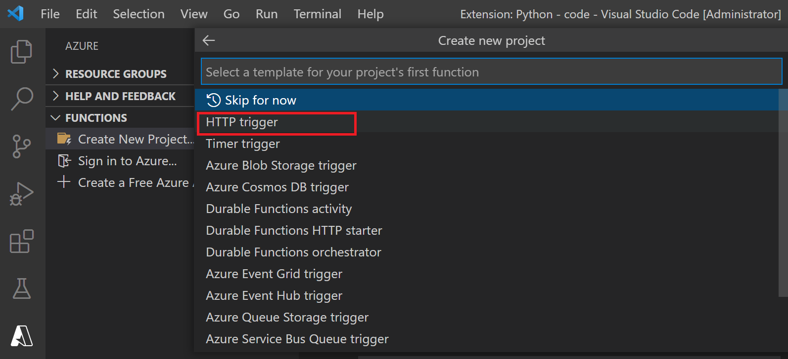

## Create an Azure Functions and Debug Locally using Ngrok

Tested on a Windows 10 Machine.

## [Part 1]
### Install Python, VSCode and VSCode Extensions
1.	Install **Anaconda Python** https://www.anaconda.com/products/individual
a.	Add the following to the Environment Variables > User Variables for …. > Path variable
    * ..\anaconda3 
    * ..\anaconda3\scripts
    * ..\anaconda3\Library\bin
2.	Install **Azure Core Functions Tool** https://github.com/Azure/azure-functions-core-tools
3.	Install **VS Code** (https://code.visualstudio.com/)
4.	Install **Azure Tools Extensions for VSCode** 

5.	Carry out the same step as above for **Azure Account** extension
6.	Install **Python Extension Pack** – see below in the screenshot
7.	Set Python Interpreter to point to Anaconda Python - see below in the screenshot. Verify installation by confirming at the bottom left corner (highlighted in red) that Python interpreter is pointing to the Anaconda version.


###Create a new Azure Functions project

* Browse to a folder (or create a new one) where you want all your project code to reside:

 * Next select Python as the interpreter.
 * Then select the Python version (in my case it will be 3.9.7)
 * For our purpose we are going to use the HTTP trigger template so click on that. 

 * Enter a name for the function. For this example we’re going to name it **GetGeoPointFromLatLon** (but it can be anything). 
 * Set the Authorization level to **Function**
 * You will now have a project structure with a basic __init__.py file and bunch of other files. You may get an error that ‘.NET Install Tools for Extension Authors’ is not installed. To install click on the Extensions icon on the left and search for ‘.NET install tool’ and install the extension:

 * Reload VS Code by pressing CTRL + SHIFT + P – type reload and click on Developer: Reload Window


### Debug locally from VS Code

 * Click Run > Start Debugging 
 *	You should see a successful debug session created within VS Code where you will also see a localhost address from which you can send requests to the function. In my case it is: http://localhost:7071/api/GetGeoPointFromLatLon (make sure it is http:// not https://)
 * When I browse to that address the following result is returned:

*This HTTP triggered function executed successfully. Pass a name in the query string or in the request body for a personalized response.*

### Debug Azure Function requests locally using ngrok

 * We will use ngrok to open an http and https tunnel to our localhost address to allow Azure Search to reach our localhost so that we can locally debug the requests coming from Azure Search
 * Download ngrok from https://ngrok.com/
 * Copy the ngrok.exe file to  root directory of the project. In my example it will look like this:
 
 * Open command prompt and change the directory to the same directory of where ngrok.exe is and run the following command: ngrok http 7071
 
 * Now you can run: http://23e9-20-126-76-4.ngrok.io/api/GetGeoPointFromLatLon
 * When you run this from a Custom Web Activity skillset in Azure Search you need to use the **https** version so: https://23e9-20-126-76-4.ngrok.io/api/GetGeoPointFromLatLon

### Update Code with Lat and Lon to GeoPoint Conversion Logic

 * Replace the contents of __ini__.py file with the content of the __init__.py file from the github repo https://github.com/thinkgradient/azure-search-custom-web-activity-functions/blob/main/__init__.py
 * The new file accepts only POST request so you won’t be able to test it from the browser as usual. Download and install Postman from https://www.postman.com/downloads/
 * Open Postman and click on File > New > Request
 * Change the request type from GET to POST and enter your ngrok address: http://3a59-20-126-76-4.ngrok.io/api/GetGeoPointFromLatLon
 * Click on Body then raw and enter the following request body content:
 ```
 {
    "values": [
        {
            "recordId": "record1",
            "data": { 
                "LON": 25.111,
                "LAT": 22.555
            }
        }
    ]
}

 ```
 * Change the request type from Text to JSON and click on Send
 * You should see an output like below:
 


### Deploy to an Azure Functions app

 * Before you can deploy the function to your Azure subscription you need to Sign in. First, make sure you’re signing it to the right tenant within VS code. To do that, within VS Code, click the **Settings icon** on the bottom left and click on **Setting** from the pop up menu. 
 * In the Search settings textbox, enter ‘**tenant**’ (without the single quotes). Make sure to enter the Tenant Id in the **Azure: Tenant** texbox:
 
 * Then on the left bar click on "**Sign in to Azure**"
  
 * Once you’re signed in, you will see all the subscriptions you have access to. Click on the Deploy to Function App button 
 
 * Select the appropriate subscription
 * Then click on "**Create a New Function App (Advanced)**"
 * Give a meaningful name to your Azure Functions (it has to be globally unique)
 * Select a **Python interpreter** that matches your local one ideally (in my case Python 3.9)
 * Create a new **resource group** or use an existing one to deploy the Azure Functions to.
 * Select the **region** where you want to deploy the Azure Functions to – ideally the same as the resource group region. 
 * Select the **hosting plan**, in our case we will choose the Consumption hosting plan.
 * Create a **storage account** or select an existing one within the same resource group where you want to store Function specific log data.
 * *Skip the creation or use of an Application Insight resource for now.*
 * At this point the Azure Function App and the HTTP trigger function will be created in the designated resource group.

### Test the Azure Function using Postman
 * Navigate to the Azure Functions created in the designated resource group
 * Click on **Functions** from the left and click on the HTTP trigger function
  
* Click on the Function and on the next page click on **Get Function Url**.
* Copy the Function Url (which also include the master key to authenticate aginst the function) and paste it in the address bar in Postman
* Keep the same request body as in the previous example with ngrok and click on Send. Observe the same JSON response.


## [Part 2]

Create Azure Search artifacts (index, indexer, data source, skillset) and point the Custom Web Activity skillset to the deployed Azure Functions.

### Create Azure Search Service

### Create Index

### Create Data Source

### Create Indexer

### Create Skillset

### Debug Skillset with the Locally Running Function (ngrok)

### Execute skillset with the Deployed Azure Function (Azure)